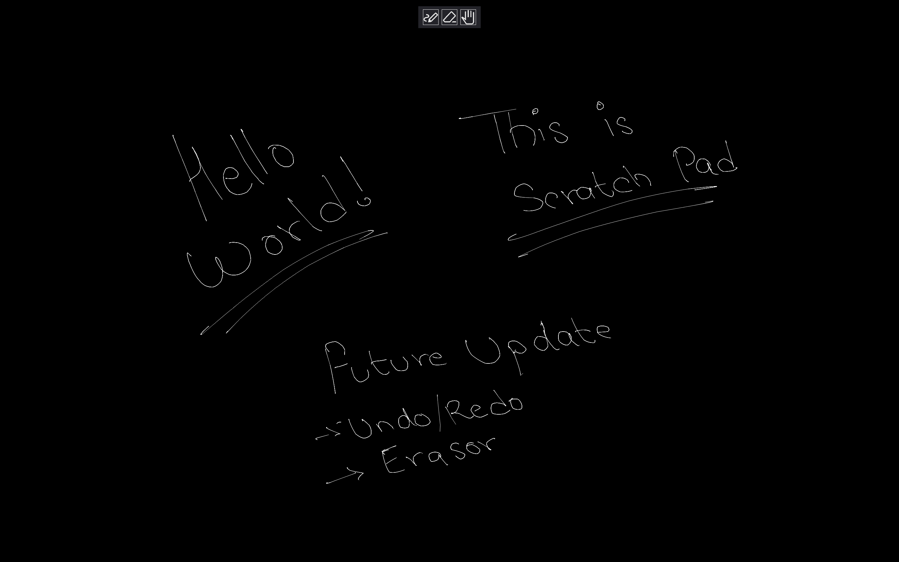

# Scratch Pad

Scratch Pad is an application in which you can sketch your ideas roughly. It is created in C with sdl2 library.

Images:



This is the better repository of my [scratch-pad](https://github.com/KenniBlank/scratch-pad) application.

# TODO:
- [X] Line Points Noise Reduction
- [ ] Curve Fitting
- [ ] Rough Rendering
- [ ] Deadzone technique, inertia, averaging
- [ ] Cubic Bezier to smoothen line

## Notes:

- Erasor tool:

    Instead of deleting points rendered, just create a new rect with erasor size that is same color as background. EASY!!!

- Data Oriented Design

    - Efficient Layout and Storage:

        Use the smallest possible data type.
        Store Data by locality of use.
        Dont waste the cache line

    - One thing at a time, many times

        Do one task multiple times in bulk if you have to.

    - Do as much ahead of time as possible

        Precomputation/ Baking

        (Dont start making data from scratch only when needed)

    - Parallelism *

        Use every core if possible.

        Cores do bulk of expensive work, then a cheap combine operation at the end.

        Avoid work that need constant sync.

General:
- Order largest to smallest in struct
- Use Enums to set which mode
- Avoid/DON'T use strings


## Ramer DouglasPeucker Algorithm
```
function DouglasPeucker(PointList, epsilon):
    start = PointList[0]
    end = PointList[-1]

    # Find the point furthest from the line start–end
    for point in PointList[1:-1]:
        d = perpendicular distance from point to line(start, end)
        track max d and point

    if max_distance > epsilon:
        # Recursive step
        left = DouglasPeucker(start to furthest_point)
        right = DouglasPeucker(furthest_point to end)

        return left[:-1] + right  # combine, avoid duplicate
    else:
        return [start, end]
```
